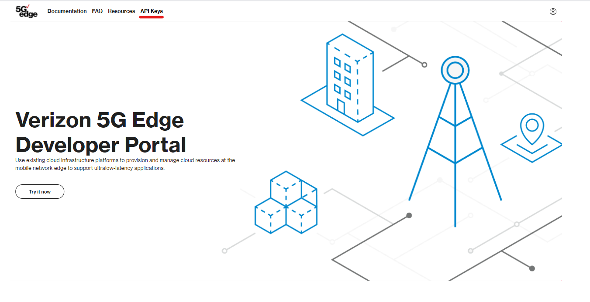
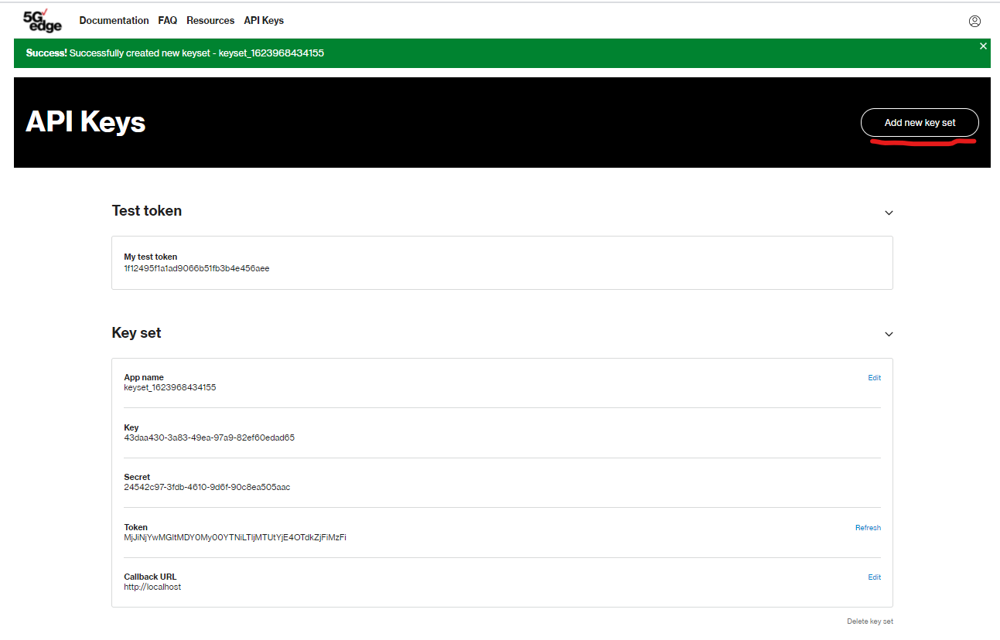

# Verizon Edge Discovery Service
> Getting Started Guide for Python Developers

The power of MEC resides in part in its ability to provide local computing with low latency, by having mobile clients use the nearest MEC node to handle application traffic. Until now, doing so has been unnecessarily complex and has relied on undifferentiated heavy lifting, including identifying client geolocation through best-effort services or, even worse, manually mapping carrier IP addresses.

Using this package, developers can seamlessly create service registries associated with the fleet of allocated Carrier IPs for their service — across any number of Wavelength Zones — and let Verizon take care of optimal route selection.

In this guided hands-on lab, learn how to use Verizon's Edge Discovery Service to launch infrastructure in the context of your geo-distributed edge application.

## Prerequisites
To complete the hands-on lab, you will need:
- The AWS CLI version 2 installed on your local machine. Ensure it’s the latest version so it supports Wavelength.
- An AWS account with sufficient privileges to create VPC resources (instances, subnets, etc.)

## Step 1: Create CloudFormation Template
We want to make it easier than ever to get started with Edge Discovery Today! If you don't already have an edge environment, go to the CloudFormation section of the AWS Console and upload the `multiEdgeSample.yaml` file we've provided in the repo. In this template, you will launch:


- An environment consisting of a Virtual Private Cloud (VPC) with 3 subnets in 3 separate Wavelength Zones
- A route table associated to each Wavelength Zone, consisting of a default route directing traffic through the Carrier Gateway
- Single EC2 instance in each Wavelength Zone, with Carrier IP automatically attached to each instance

This provides you with the perfect setup to get started with dynamic routing at the edge with Verizon EDS.

## Step 2: Configure the Verizon Edge Discovery Service
For the first step, you'll need to create account on our [5G Edge Portal](https://5gedge.verizon.com/) to access a key pair. Once logged in, visit the `API Keys` subsection of the developer portal to get started.



Next, click `Add new key set` in the top-right corner to generate your key pair. You'll notice the application key and secret key and automatically generated below.



Once you have generated your key pair, take note of your `APP_KEY` and your `SECRET_KEY` pair from the console. From there, ensure `vzEdgeDiscovery.py` is within your working directory.

Next, enter a Python shell from within the command line, and authenticate with EDS to receive a token for future requests. Store the result with the variable `access_token`. Be sure to import the `vzEdgeDiscovery` module and `random` library to auto-generate unique application IDs.

```
import vzEdgeDiscovery
import random

access_token=vzEdgeDiscovery.authenticate(appKey="<your-key>",secretKey="<your-secret-key>")

```

Successful authentication to the API will return an access token that you will use for the duration of the tutorial. For simplicity, we've stored this access token as a variable, `access_token`.

```
Authenticating to EDS...
Your access token: MTg2NWRhZDgtMmQ0Zi00YjI3LTkwMGQtZmY2ZDFkNWQyODNi
```

Next, we can create our service profile. This will help EDS understand the nature of the application requirements. In this case, as we build our service profile, all we need to tell the Edge Discovery Service is the ideal maximal latency threshold our application can handle. In this case, we'll use the `createServiceProfile()` method and pass two arguments: our access token and our desired upper bound latency threshold (In this case, we have notated `40`, as an example).

```
serviceProfileId=vzEdgeDiscovery.createServiceProfile(accessToken=access_token,maxLatency=40)
```
Upon completion, the API will return the serviceProfileID, which will be essential when instantiating your service registry with Carrier IP records.

```
Creating service profile with network performance parameters...
Your Service Profile ID: 5369457a-2cca-4f96-877f-acc9604172dc
```

Lastly, let's add all of our Wavelength Zones and Carrier IP addresses we've stored as variables to our Service Registry. This will help future mobile clients determine which is the closest endpoint to which they can connect.

In this case, the `createServiceRegistry()` method requires 5 arguments:
- `accessToken`: Your access token
- `serviceProfileId`: Your service profile you created in the previous step
- `carrierIps`: A list of Carrier IP addresses (list can be of arbitrary size) corresponding to your application service
- `availabilityZones`: A list of availability zone IDs, otherwise known as ERNs. Please ensure that the length of this list matches that of the Carrier IP addresses.
- `applicationId`: Your application ID (note this must be unique to each serviceProfile)

In this case, let's use the 3 EC2 instances we just created from the CloudFormation template above:
- 155.146.0.225: Boston Wavelength Zone
- 155.146.65.19: NYC Wavelength Zone
- 155.146.37.12: Washington, DC Wavelength Zone

```
serviceEndpointsId=vzEdgeDiscovery.createServiceRegistry(accessToken=access_token,serviceProfileId=serviceProfileId,carrierIps=["155.146.0.225","155.146.65.19","155.146.65.19"],availabilityZones=["us-east-1-wl1-bos-wlz-1","us-east-1-wl1-nyc-wlz-1","us-east-1-wl1-was-wlz-1"],applicationId="VZ_5G_Edge_Test_App_"+str(random.randint(0,100)))
```

Upon completion, the API we will return the serviceEndpointsId, which you will need in future requests from mobile devices seeking to identify the closest MEC endpoint.

```
Creating service registry with Carrier IP information...
{'serviceEndpointsId': '86014dfb-6bf7-4450-9e2b-48da86c616e0'}
Your Service Endpoints ID: 86014dfb-6bf7-4450-9e2b-48da86c616e0
```


## Step 3: Identify Optimal Endpoint from Mobile Device
Congratulations, you have now completed setting up your service registry! From a mobile device, authenticate to EDS and discover the closest endpoint to the client's IP address. Your device's IP address (ex: 174.249.33.62) can be collected by navigating to `ifconfig.me` or can be queried using `curl ifconfig.me` from the command line.

```
import vzEdgeDiscovery
access_token=vzEdgeDiscovery.authenticate(appKey="<your-app-key>",secretKey="<your-secret-key>")
closestZone=vzEdgeDiscovery.discoverClosestEdgeZone(accessToken=access_token,serviceEndpointsId="<your-service-registry>",UEIdentity="<your-mobile-ip-address>")
```

The API will return both the optimal Carrier IP address and edge zone.
```
Selecting closest Mobile Edge Computing (MEC) endpoint...
Your Closest Edge Zone: us-east-1-wl1-bos-wlz-1
Your Closest IP Address: 155.146.96.195
```

## Resources
To learn more, visit the [5G Edge Documentation](https://www98.verizon.com/business/5g-edge-portal/documentation/verizon-5g-edge-discovery-service/get-started.html/) to learn more.

Any questions? Reach out to verizon5gedge[at]verizon.com or create an issue on the repository, type a title and description, and provide your error message for reproducibility.
