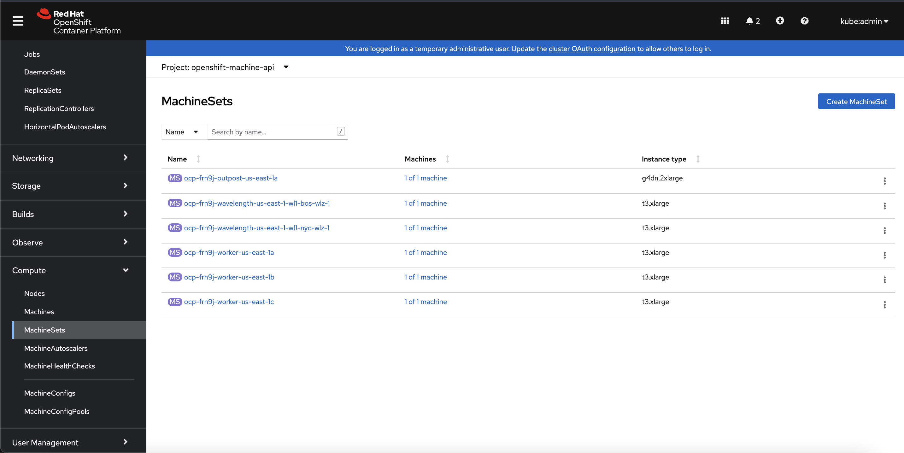

# OpenShift on Verizon 5G Edge
Red Hat® OpenShift® is an open-source container application platform based on the Kubernetes® container orchestrator that supports an enterprise hybrid cloud. Using Verizon 5G Edge, developers can extend their containerized architecture to the network edge by moving worker nodes to mobile edge computing (MEC) zones while keeping the control plane in the parent region (e.g., the traditional Amazon Web Services® [AWS®] region).

In this tutorial, you will launch your first virtual private cloud (VPC) with subnets in the parent region and in AWS Wavelength Zones. After configuring your carrier gateway, you will launch a cluster of worker nodes using OpenShift.

## Getting Started
To extend your first OpenShift cluster to AWS Wavelength, visit either of the following tututorials:

* [OpenShift on AWS Wavelength Automation (Ansible playbook)](https://github.com/vchintal/openshift-aws-wavelength)

* [Building your first Red Hat OpenShift cluster on Verizon 5G Edge (Verizon 5G Edge Blog)](https://verizon5gedgeblog.medium.com/building-your-first-red-hat-openshift-cluster-on-verizon-5g-edge-f9c2f07e8f20)

## Preview: Architecture Overview
In this architecture, you will define MachineSets for your Wavelength Zone(s) and Outpost(s), if appropriate, and OpenShift will instantiate Machines accordingly.

## Contributors
This integration was made possible thanks to the Red Hat team: specifically Ashish Aggarwal and Vijay Chintalapati.

