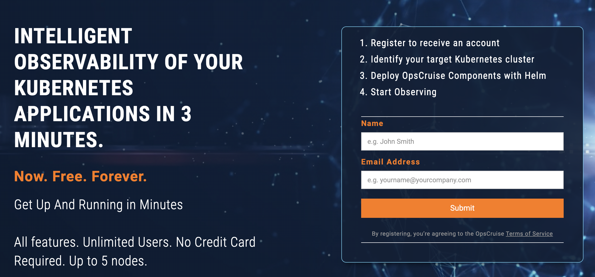
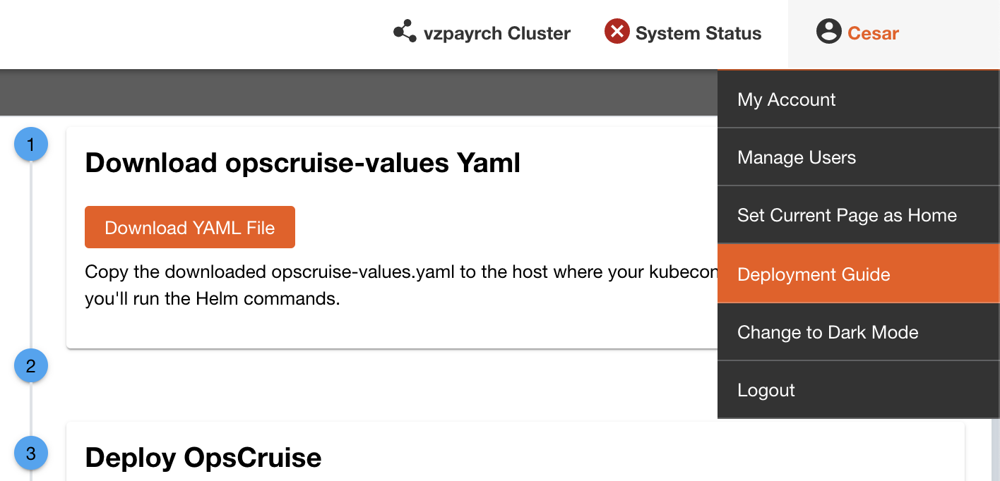
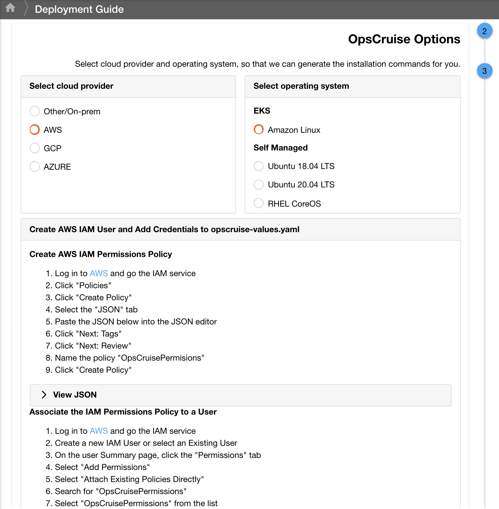

# Deploy EKS Cluster with Worker Nodes in Wavelength Zone

These commands should be run through the aws cli (download here: https://docs.aws.amazon.com/cli/latest/userguide/getting-started-install.html). Uploading the CloudFormation script into the AWS CloudFormation UI and providing the Parameters.

# Getting Started
1. Go to https://opscruise.com/free-forever and sign up for an OpsCruise account.



2. Once your OpsCruise instance has been created, log in to your OpsCruise instance
3. Click on your **user name** in the upper right corner, then **Deployment Guide**
4. Click on **Download YAML File**



5. In Section 2 of the Deployment guide, select **AWS**, then **Amazon Linux**, and follow the instructions to create an IAM role in order to allow OpsCruise to query AWS



6. Upload your opscruise-values.yaml to an S3 bucket and have the URL handy (you’ll need it in Step 7)
7. Run the commands below:

# Commands to Run

## Clone the repository and move into the opscruise directory.


```
git clone https://github.com/Verizon/5GEdgeTutorials.git
cd ./5GEdgeTutorials/opscruise
```

## Create IAM roles and activate Helm & EKS Types.


You only need to run this next command once (but it's idempotent).

```
aws cloudformation deploy \
    --template-file ./awsqseks-helm-typeactivation.packaged.yaml \
    --stack-name AWSEKSTypeActivation \
    --capabilities CAPABILITY_NAMED_IAM
```


## Deploy EKS Cluster in Wavelength with OpsCruise built-in.

Make sure to change the **OpsCruiseValuesURL**, **EKSClusterAdminArn**, **EKSClusterAdminName**,
and **AWSQSHelmExecutionRole** parameters

- **OpsCruiseValuesURL** is an **S3** URL to your opscruise-values.yaml (must upload the file to an S3 bucket)
- **EKSClusterAdminArn** is the ARN for the user you want to be an admin on the EKS Cluster
- **EKSClusterAdminName** is the username for the EKS Cluster Admin (you can name it anything)
- **AWSQSHelmExecutionRole** is the ARN from the previous command. Found in the CloudFormation outputs for the AWSEKSTypeActivation stack

The last line updates your kubeconfig with the the new cluster's credentials and sets it as the active context.

```
EKSwOCStackName=eksCluster-wOpsCruise-$(date +%b%d%Y-%H%M)

aws cloudformation deploy --template-file ./wavelength-eksCluster-withOpsCruise.packaged.yml \
    --stack-name $EKSwOCStackName \
    --capabilities CAPABILITY_NAMED_IAM \
    --parameter-overrides \
        OpsCruiseValuesURL="S3_URL_TO_OPSCRUISE_VALUES_YAML" \
        EKSClusterAdminArn=$ARN_FOR_EKS_CLUSTER_ADMIN_USER \
        EKSClusterAdminName=$CLUSTER_ADMIN_USERNAME \
        OpsCruiseGWVersion=3.1.1 \
        OpsCruiseCollectorsVersion=3.1.1 \
        AWSQSHelmExecutionRole=$HELM_EXECUTION_ROLE

aws eks update-kubeconfig --name ${EKSwOCStackName}-k8s
```