# Verizon 5G Edge Tutorial with Sumo Logic

Have you built your first application on Verizon 5G Edge but are not sure how to instrument it at scale? Have you experimented with 5G Edge but question how to move the environment to production in the absence of a performance monitoring approach? In this article, learn how to leverage Sumo Logic’s Installed Collector to seamlessly monitor infrastructure—at a fraction of the cost of CloudWatch—across your edge and parent region deployments. 

The shift to cloud computing and modern app architectures is creating a data tsunami. This data is rich in value if customers can act upon it with confidence and speed to drive differentiated customer experiences.

At Sumo Logic, we’re putting the power of machine data analytics in the hands of everyone by unifying all data types, enabling universal access and leveraging cloud economics—all from our single, cloud-native, Continuous Intelligence Platform™ delivered and consumed as a true SaaS. Here’s why we matter.

To monitor infrastructure, we offer an Installed Collector, which is a Java agent that collects logs and metrics from its Sources and then encrypts, compresses, and sends the data to the Sumo Logic service. As its name implies, an Installed Collector is installed in your environment. Another collector we offer is a Hosted Collector that resides within your account in the Sumo Logic service. After installing the Collector, you would add Sources, from which the Collector obtains data to send to the Sumo service. Those sources consist of things like Windows Event logs, Linuxux system log, host-level metrics, application logs and more.

You can install Collectors and configure Sources on any mix of Windows, Linux, and MacOS hosts in your environment. When deciding where to install Collectors, consider your network topology, available bandwidth, and domains or user groups.

There are a variety of ways to deploy Installed Collectors in your environment that include collectors that gather logs, metrics and traces from a single device as well as a dedicated collector that acts as an aggregation/centralization point for multiple systems to send logs, metrics, traces and syslog messages. 

When you start up an Installed Collector for the first time it registers with your account in the Sumo Logic service and creates any Sources that you have pre-defined in a UTF-8 encoded JSON source configuration file. In the upcoming example we will enable the creation of a Linux-based EC2 instance running in a traditional AWS Availability Zone (AZ) as well as a Linux-based EC2 instance running in the Verizon 5G Edge environment. AWS calls that environment a WaveLength Zone (WZ). Each of the servers will have an Installed Collector automatically deployed and installed, as well as configured to send in host metrics (CPU, Memory, Disk, Network) in addition to the OS messages located in the /var/log directory.

The systems deployed in AWS will be deployed using a CloudFormation Template. The result of the setup will be that a user can see host metrics and OS-level messages for each of the servers in dashboards in their Sumo Logic Trial account. Users will also be able to quickly differentiate the servers based on a variety of factors.

**Getting Started with Sumo Logic**


Before setting up anything in the 5G Edge environment, we need to have a place to which we send the data. That place is a Sumo Logic account. If you don't have a Sumo Logic account, signup for a free trial [here.](https://www.sumologic.com/sign-up/)


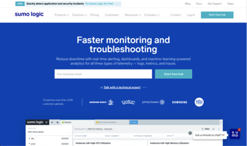


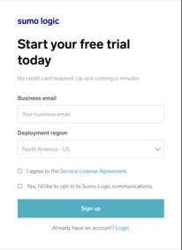


Check your email, and click on the link to start with Sumo Logic. Once you click on the email link, you will be brought to the following page inside Sumo Logic. Fill out the fields on the page, then activate your account.


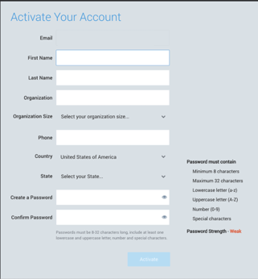


Fill out all the fields to enable the “Activate” button. Once completed, click “Activate”.

At this point, another window will appear but click on the upper right corner to close this out, as for now, we are setting up the initial collection using the upcoming CloudFormation Template.

After you hit the “x”, you will see the following screen:


 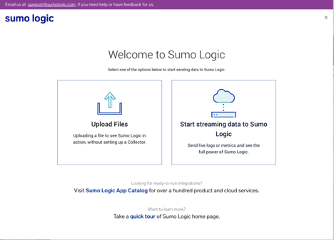


At this point, we need to set up an API key so that the AWS CloudFormation Template can set up some collection and Dashboards in the account. 

On the left column, click on your username, and then preferences:


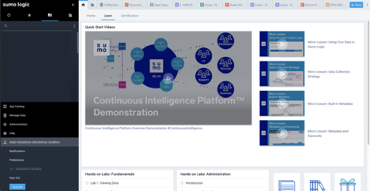


On the preferences page, in the middle, click on the “Add Access Key” button.


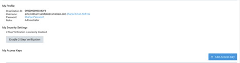
 

That will open a dialog box to fill in the name of the access key you are creating. Go ahead and give it any name then hit the “Create Key” button. In this example we used 5GEdge:


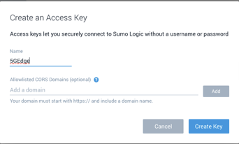


Once you hit “Create,” another dialog box opens showing the Access ID and the Access Key. Make sure that you copy BOTH of the values and store them securely before hitting the “Done” box. The Access Key value is only visible at this time and will no longer be visible once “Done” is pressed. These two entities (Access ID and Access Key) will be needed when configuring the CloudFormation Template.


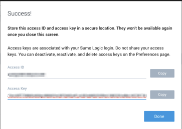


Once you have the Key and ID, it is time to go over to AWS and deploy the CloudFormation Template.


### Getting started on 5G Edge


#### Launch Your CloudFormation Template

To start, let’s use CloudFormation to instantiate our Verizon 5G Edge environment with AWS Wavelength. To showcase how Sumo Logic can seamlessly filter between edge and parent-region nodes we developed the following infrastructure example:


* Single VPC in a region of your choice (i.e., us-east-1 or us-west-2) with 2 subnets: 1 in a traditional Availability Zone (e.g., us-east-1a) and 1 in a Wavelength Zone (e.g., us-east-1-wl1-nyc-wlz-1)
* Attached to the VPC includes an Internet Gateway for our Availability Zone and a Carrier Gateway for the Wavelength Zone. Note that a Carrier Gateway has similar characteristics to an Internet Gateway but is used specifically in Wavelength Zone for NAT between private IP addresses and Carrier IP addresses -- those addresses allocated to Verizon-facing "public" endpoints. To learn more about the Carrier Gateway, visit the[ developer guide.](https://docs.aws.amazon.com/wavelength/latest/developerguide/aws-wavelength-developer-guide.pdf)
* Sets up 1 EC2 instance in each subnet with the Sumo Logic collector already installed and configured to send host based metrics and OS Logs to the Sumo Service.

To get started, pull down the GitHub repository with our CloudFormation template and navigate to the directory.

 
```
git clone[ https://github.com/Verizon/5GEdgeTutorials.git](https://github.com/Verizon/5GEdgeTutorials.git)
cd sumologic-tutorial/
```
 

Next, run the AWS CLI to create your CloudFormation Stack. For the Stack to create successfully, be sure to change 3 values:

**`<your-key-pair>`** - Change this value to any existing AWS EC2 key pair you have in that region

**`<your-sumo-access-id>`** - Use your access ID you retrieved from the Sumo Logic console earlier

**`<your-sumo-access-key>`** - Use your access key you retrieved from the Sumo Logic console earlier

 
```
aws cloudformation create-stack --stack-name sumologic --template-body file://demo-instrumentation-environment.yaml \
--parameters ParameterKey=EnvironmentName,ParameterValue=SumoLogic ParameterKey=KeyName,ParameterValue=&lt;your-key-pair> ParameterKey=SumoAccessId,ParameterValue=&lt;your-sumo-access-id> ParameterKey=SumoAccessKey,ParameterValue=&lt;your-sumo-access-key> \
--capabilities CAPABILITY_IAM
```
 

After successful launch, you should see the AWS CLI return back the Amazon resource name (ARN) of the stack itself.

```
{

	"StackId": "arn:aws:cloudformation:us-east-1:<your_account>:stack/sumologic/<uuid>"

}
```
 

 


### See what’s happening using Sumo Logic

 

Now that the Cloud Formation template has completed, wait a few minutes for everything to finish starting up and registering.


If you go to your Sumo Logic Account, and open the “Manage Data” → “Collection” page, you can see that there are two Installed collectors and they are configured to send in the Host Metrics for each Collector.

If you look on the left side at the top in the “Personal” Folder (the folder with the icon of a person in it) and you open it, you should see a dashboard labeled: Host Metrics (EC2).

If you double click on one of the dashboards in the list (for example “1: AWS EC2 Metrics - Summary”), you will open up a dashboard showing a variety of collected metrics about both of the Linux servers. You can use the filters at the top of the dashboard to focus on just the server in the 5G Edge or just the server in the Availability Zone.


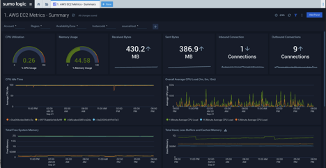
 

#### Viewing log data:

To view log data using dashboards specific to Linux log messages, you can install the “Linux - Cloud Security Monitoring and Analytics” App from the App Catalog.

On the left-hand menu, click on App Catalog and search for Linux to see the Linux-specific apps.


 

Select the “Linux - Cloud Security Monitoring and Analytics” app, and then click “Add to Library”


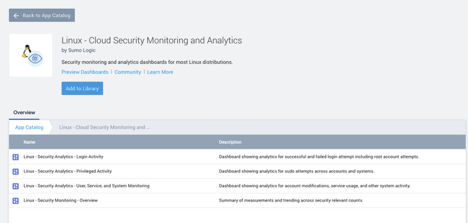


Another dialog box will open. On that Dialog box, click on the Source Category on the lower right side and select “OS_messages” from the Drop Down.


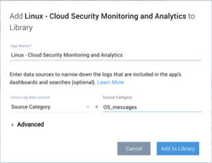


You will be taken to the Folder Tab to see what was just installed:


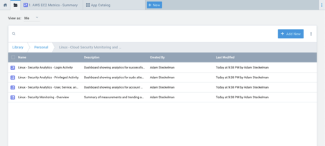


Click on any of the dashboards to see a variety of security-related information coming via logs to Sumo from the collectors running in AWS.
